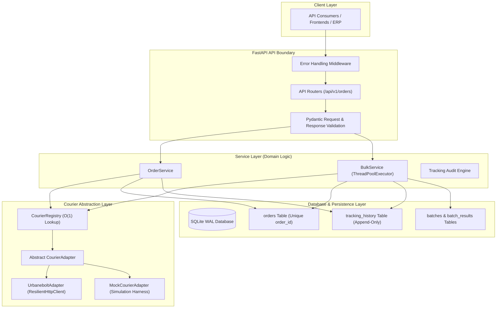
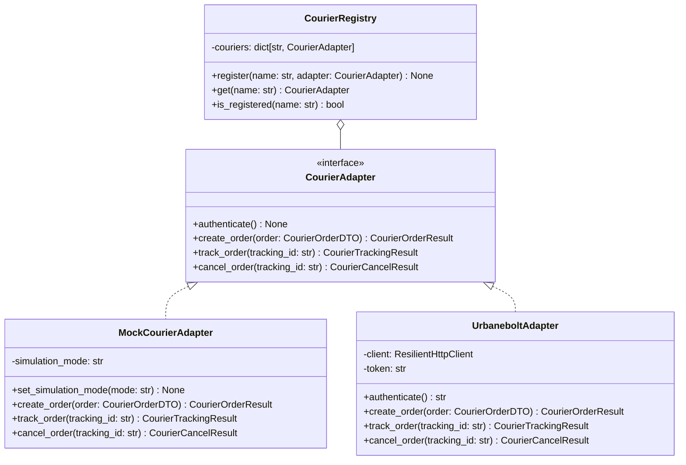
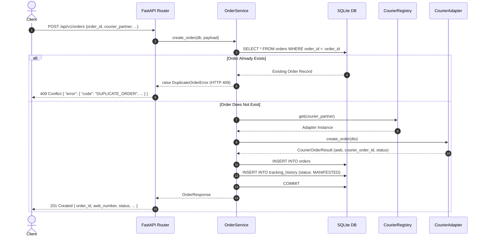
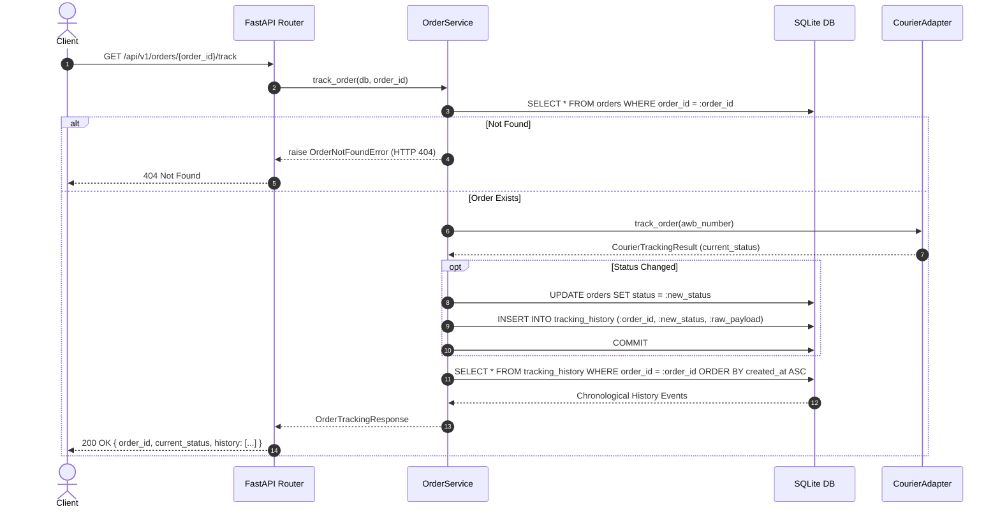
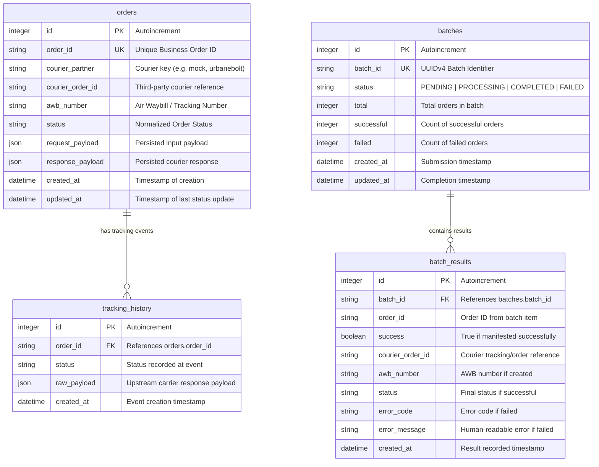
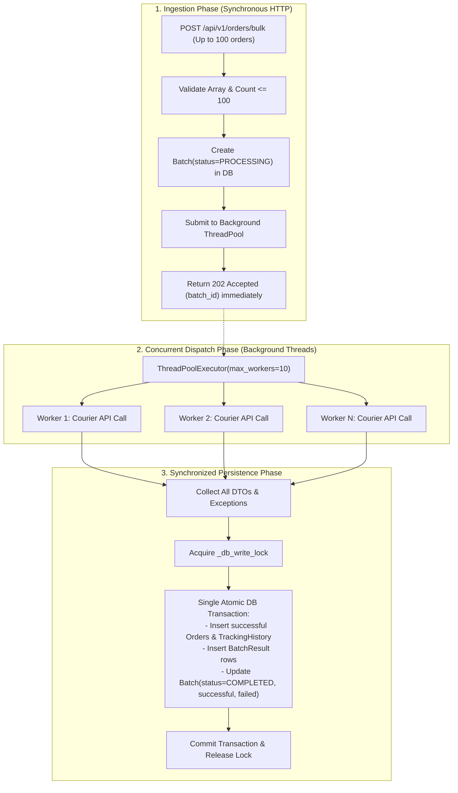
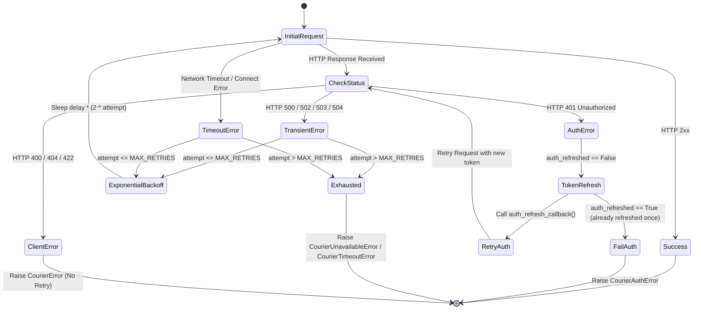

# System Design & Architecture Document

This document provides a detailed technical overview of the **Courier Integration Platform**, explaining the architectural patterns, database model, request lifecycles, concurrency model, resilience mechanisms, and extensibility guidelines.

---

## 1. High-Level Architecture

The platform follows a layered, hexagonal-inspired architecture that isolates volatile third-party courier contracts from the core business domain:



### Architectural Principles
1. **Decoupled Core:** Business logic (`OrderService`, `BulkService`) knows only about the abstract `CourierAdapter` and normalized domain transfer objects (`CourierOrderDTO`). It never references `UrbaneboltAdapter` or `MockCourierAdapter` directly.
2. **Open/Closed Principle:** New couriers are introduced by implementing `CourierAdapter` and registering with `CourierRegistry` without changing existing route handlers or services.
3. **Resilience & Fault Isolation:** Courier timeouts and network failures are isolated within the adapter layer with exponential backoff and transparent auth token recovery.

---

## 2. Adapter Pattern & Courier Abstraction

Third-party logistics providers (3PLs) vary wildly in their payload formats, field naming, authentication methods, and status codes. The platform standardizes these variations through the **Adapter Pattern**:



### Unified Data Transfer Objects (DTOs)
- **`CourierOrderDTO`**: Normalizes customer data, addresses, dimensions, weight, and items.
- **`CourierOrderResult`**: Standardized return payload containing `courier_order_id`, `awb_number`, `status`, and `tracking_url`.
- **`CourierTrackingResult`**: Normalized status mapping (`MANIFESTED`, `PICKED_UP`, `IN_TRANSIT`, `OUT_FOR_DELIVERY`, `DELIVERED`, `CANCELLED`, `RTO`).
- **`CourierCancelResult`**: Standardized cancellation confirmation.

---

## 3. Courier Registry

The `CourierRegistry` maintains an internal dictionary mapping normalized courier keys (e.g., `"urbanebolt"`, `"mock"`) to their respective adapter instances.

- **Zero If/Elif Statements:** Eliminates hardcoded branching across the codebase:
  ```python
  adapter = courier_registry.get(courier_partner)
  result = adapter.create_order(dto)
  ```
- **Case-Insensitive Normalization:** Keys are stripped and converted to lowercase (`"UrbaneBolt"` -> `"urbanebolt"`).
- **Lookup Cost:** `O(1)` dictionary lookup.
- **Unknown Courier Handling:** Attempting to retrieve an unregistered courier immediately raises `CourierNotFoundError` (mapped to HTTP 404 with structured error envelope).

---

## 4. Request Flows

### 4.1. Order Creation & Idempotency Flow



### 4.2. Order Tracking & Audit Flow



---

## 5. Database Design

The relational schema is implemented in SQLite using SQLAlchemy 2.0. To ensure maximum concurrency and integrity, SQLite is configured with Write-Ahead Logging (`PRAGMA journal_mode=WAL`), foreign key enforcement (`PRAGMA foreign_keys=ON`), and a 30-second busy timeout.



### Design Decisions
- **`order_id` as Business Key:** Enforced unique index at the database level prevents duplicate shipments across concurrent requests.
- **Append-Only `tracking_history`:** Each track request or status modification writes a new immutable row. Records are never updated or deleted, providing a complete historical audit trail.
- **JSON Payload Auditing:** `request_payload` and `response_payload` preserve exact raw data for debugging and carrier reconciliation.

---

## 6. Bulk Processing Concurrency Model

Per task specification, the platform operates **without external queue infrastructure** (no Celery, Redis, RabbitMQ, or Kafka). Concurrency is achieved using an in-process worker pool designed to avoid SQLite locking pitfalls.



### Concurrency Decoupling & SQLite Safety
SQLite supports multiple concurrent readers in WAL mode, but only **one writer** at any given moment. Under high thread concurrency, multiple threads executing simultaneous write transactions cause `sqlite3.OperationalError: database is locked`.

**The Solution:**
1. **Network I/O Phase:** Worker threads execute slow HTTP network calls to external courier APIs fully in parallel (up to 10 concurrent requests).
2. **Persistence Phase:** Once all worker threads complete, all database writes (`Order`, `TrackingHistory`, `BatchResult`, `Batch`) are committed in **one single atomic transaction** guarded by `_db_write_lock`.
3. This guarantees maximum network throughput while completely eliminating database lock contention.

---

## 7. Resilience & Retry Strategy

Network calls to logistics partners are inherently volatile. The `ResilientHttpClient` wraps `httpx.Client` to provide self-healing communication:



### Key Retry Parameters
- **`MAX_RETRIES`**: Configurable (default `3`).
- **`RETRY_DELAY`**: Configurable base delay (default `0.5s`).
- **Backoff Calculation**: `sleep_time = RETRY_DELAY * (2 ** attempt)` (exponential growth: 0.5s -> 1.0s -> 2.0s).
- **Transparent Auth Refresh**: On HTTP 401, the client invokes `auth_refresh_callback()` to obtain a fresh token and retries the original request exactly once. If the second request also fails with 401, it raises `CourierAuthError` immediately to prevent infinite authentication loops.

---

## 8. Idempotency Implementation

To prevent double-billing and duplicate physical shipping labels:
1. **Database Uniqueness:** The `orders.order_id` column carries a database-level `UNIQUE` constraint.
2. **Pre-Dispatch Check:** Before dispatching an order to a courier API, `OrderService.create_order` performs a fast lookup on `order_id`:
   ```python
   existing = db.execute(select(Order).where(Order.order_id == order_id)).scalars().first()
   if existing:
       raise DuplicateOrderError(order_id=order_id, details={...})
   ```
3. **Double-Check on Commit:** If two concurrent requests arrive simultaneously with the same `order_id`, the database constraint will raise an `IntegrityError` on the second transaction, which is caught and transformed into `DuplicateOrderError` (HTTP 409).
4. **No External Courier Side-Effects:** Duplicate requests never trigger outbound API calls to shipping partners.

---

## 9. Error Handling Architecture

The platform provides a centralized, normalized error response envelope across all API endpoints:

```json
{
  "error": {
    "code": "ORDER_NOT_FOUND",
    "message": "Order 'ORD-9999' not found",
    "request_id": "req-b28f731a-e8d9-4841-a1d2-7c38c4bfb0d3",
    "details": {
      "order_id": "ORD-9999"
    }
  }
}
```

### Exception Hierarchy
```
Exception
 └── AppError (status_code, code, message, details)
      ├── ValidationError (400)
      ├── EntityNotFoundError (404)
      │    ├── OrderNotFoundError (404)
      │    └── BatchNotFoundError (404)
      ├── DuplicateOrderError (409)
      ├── IdempotencyConflictError (409)
      ├── OrderAlreadyCancelledError (409)
      ├── BulkLimitExceededError (400)
      └── CourierError (502)
           ├── CourierNotFoundError (404)
           ├── CourierTimeoutError (504)
           ├── CourierUnavailableError (503)
           ├── CourierAuthError (502)
           └── CourierRateLimitError (429)
```

All unhandled Python exceptions (e.g. unexpected runtime errors) are intercepted by the `ErrorHandlingMiddleware`, masked with code `INTERNAL_SERVER_ERROR` (HTTP 500), and tagged with a unique `request_id` to prevent leaking internal stack traces to API consumers.

---

## 10. Architectural Trade-offs

| Decision | Pros | Cons / Mitigations |
| :--- | :--- | :--- |
| **SQLite (WAL mode) vs PostgreSQL** | Zero installation; zero external daemon dependencies; fully self-contained for local dev and testing. | Single writer limitation. Mitigated by WAL mode, 30s busy timeout, and batching DB writes into a single transaction. |
| **In-Process ThreadPool vs Celery/Redis** | Complies strictly with zero external queue constraint; simple deployment; immediate execution. | If application process is killed, in-flight background tasks are lost. Mitigated by persisting batch state (`PROCESSING`) before execution. |
| **Decoupled Database Commits in Bulk** | High concurrency for courier network calls without database locks. | All orders in a batch must complete network calls before batch state is persisted. Acceptable for batches up to 100 orders. |
| **Synchronous Tracking Updates** | Ensures caller receives guaranteed fresh status from carrier on each track call. | Slightly higher latency during track requests. Mitigated by courier client timeouts (10s) and fast connection pooling. |

---

## 11. Extensibility: Adding a New Courier

The architecture adheres strictly to the Open/Closed Principle. Adding a new logistics partner involves exactly three steps:

1. **Implement `CourierAdapter`:**
   Create `app/couriers/{provider}.py` and implement the four abstract methods (`authenticate`, `create_order`, `track_order`, `cancel_order`).
2. **Translate to Normalized DTOs:**
   Map the incoming `CourierOrderDTO` into the carrier's proprietary JSON format, and map the carrier's response into `CourierOrderResult` / `CourierTrackingResult`.
3. **Register Adapter:**
   Register the adapter with `CourierRegistry.register("{provider}", AdapterInstance())`.

No changes are ever required in `OrderService`, `BulkService`, or any route definitions.
